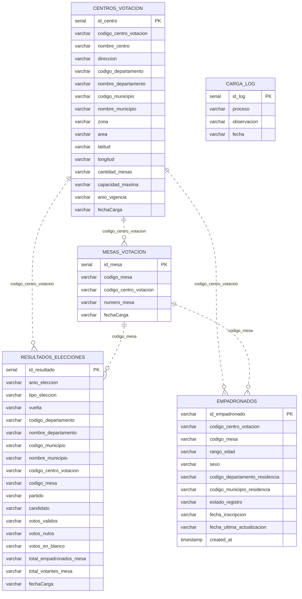

# Documentación de la base de datos (modelo actual)

Esquema: `electoral` — PostgreSQL 14+
Script de creación: [`sql/01_ddl_electoral.sql`](../sql/01_ddl_electoral.sql)
DER editable: [`docs/der_modelo_actual.dbml`](der_modelo_actual.dbml)

> Este modelo se entrega tal como está en producción. Sobre él debes ejecutar la carga. La crítica al modelo es un entregable aparte (`docs/MEJORAS_MODELO.md`).

## 1. Diagrama entidad-relación

Las líneas representan relaciones **lógicas**: en la base de datos no existen llaves foráneas declaradas.

## 2. Diccionario de datos

### 2.1 `electoral.centros_votacion`

Catálogo de centros de votación. Carga única a partir de `data/historico/centros_votacion.csv`.

| Columna | Tipo | Nulable | Descripción |
|---|---|---|---|
| `id_centro` | `serial` | No (PK) | Identificador técnico autoincremental |
| `codigo_centro_votacion` | `varchar(50)` | Sí | Código del centro en la fuente. No tiene restricción de unicidad |
| `nombre_centro` | `varchar(255)` | Sí | Nombre del establecimiento |
| `direccion` | `varchar(255)` | Sí | Dirección textual |
| `codigo_departamento` | `varchar(50)` | Sí | Código de departamento (2 dígitos) |
| `nombre_departamento` | `varchar(255)` | Sí | Nombre del departamento tal como viene en la fuente |
| `codigo_municipio` | `varchar(50)` | Sí | Código de municipio (4 dígitos: depto + secuencia) |
| `nombre_municipio` | `varchar(255)` | Sí | Nombre del municipio tal como viene en la fuente |
| `zona` | `varchar(50)` | Sí | Zona urbana del centro |
| `area` | `varchar(50)` | Sí | Área: urbana / rural. Valores no estandarizados en la fuente |
| `latitud` | `varchar(50)` | Sí | Latitud. Puede venir con coma decimal o vacía |
| `longitud` | `varchar(50)` | Sí | Longitud. Puede venir vacía |
| `cantidad_mesas` | `varchar(50)` | Sí | Número de mesas del centro |
| `capacidad_maxima` | `varchar(50)` | Sí | Capacidad máxima de empadronados del centro |
| `anio_vigencia` | `varchar(50)` | Sí | Año de la elección en que estuvo vigente |
| `fechaCarga` | `varchar(50)` | Sí | Fecha en que el ETL insertó la fila |

### 2.2 `electoral.mesas_votacion`

Mesas de votación. Se deriva de los códigos de mesa presentes en las fuentes de resultados y padrón.

| Columna | Tipo | Nulable | Descripción |
|---|---|---|---|
| `id_mesa` | `serial` | No (PK) | Identificador técnico autoincremental |
| `codigo_mesa` | `varchar(50)` | Sí | Código de mesa (formato `<centro>-<nn>`) |
| `codigo_centro_votacion` | `varchar(50)` | Sí | Centro al que pertenece la mesa |
| `numero_mesa` | `varchar(50)` | Sí | Número de mesa dentro del centro |
| `fechaCarga` | `varchar(50)` | Sí | Fecha en que el ETL insertó la fila |

### 2.3 `electoral.resultados_elecciones`

Resultados históricos. Grano: una fila por elección + vuelta + mesa + partido. Los totales de la mesa se repiten en cada fila de partido. Carga única a partir de `data/historico/resultados_historicos.csv`.

| Columna | Tipo | Nulable | Descripción |
|---|---|---|---|
| `id_resultado` | `serial` | No (PK) | Identificador técnico autoincremental |
| `anio_eleccion` | `varchar(50)` | Sí | Año del evento electoral |
| `tipo_eleccion` | `varchar(50)` | Sí | presidencial / legislativa / municipal |
| `vuelta` | `varchar(50)` | Sí | 1 o 2. Vacío cuando el tipo de elección no tiene segunda vuelta |
| `codigo_departamento` | `varchar(50)` | Sí | Código de departamento |
| `nombre_departamento` | `varchar(255)` | Sí | Nombre del departamento |
| `codigo_municipio` | `varchar(50)` | Sí | Código de municipio |
| `nombre_municipio` | `varchar(255)` | Sí | Nombre del municipio |
| `codigo_centro_votacion` | `varchar(50)` | Sí | Centro de votación |
| `codigo_mesa` | `varchar(50)` | Sí | Mesa |
| `partido` | `varchar(255)` | Sí | Partido político. Valores no estandarizados en la fuente |
| `candidato` | `varchar(255)` | Sí | Nombre del candidato |
| `votos_validos` | `varchar(50)` | Sí | Votos válidos del partido en la mesa |
| `votos_nulos` | `varchar(50)` | Sí | Votos nulos de la mesa (repetido por partido) |
| `votos_en_blanco` | `varchar(50)` | Sí | Votos en blanco de la mesa (repetido por partido) |
| `total_empadronados_mesa` | `varchar(50)` | Sí | Empadronados asignados a la mesa (repetido por partido) |
| `total_votantes_mesa` | `varchar(50)` | Sí | Votantes que sufragaron en la mesa (repetido por partido) |
| `fechaCarga` | `varchar(50)` | Sí | Fecha en que el ETL insertó la fila |

### 2.4 `electoral.empadronados`

Padrón vigente. Fuente viva: se recibe un archivo por día en `data/empadronados/`.

| Columna | Tipo | Nulable | Descripción |
|---|---|---|---|
| `id_empadronado` | `varchar(50)` | No (PK) | Identificador del ciudadano empadronado |
| `codigo_centro_votacion` | `varchar(50)` | Sí | Centro donde le corresponde votar |
| `codigo_mesa` | `varchar(50)` | Sí | Mesa asignada |
| `rango_edad` | `varchar(50)` | Sí | Rango de edad. Valores no estandarizados en la fuente |
| `sexo` | `varchar(50)` | Sí | Sexo. Valores no estandarizados en la fuente |
| `codigo_departamento_residencia` | `varchar(50)` | Sí | Departamento de residencia |
| `codigo_municipio_residencia` | `varchar(50)` | Sí | Municipio de residencia |
| `estado_registro` | `varchar(50)` | Sí | activo / suspendido / fallecido |
| `fecha_inscripcion` | `varchar(50)` | Sí | Fecha de inscripción. Formato mixto en la fuente |
| `fecha_ultima_actualizacion` | `varchar(50)` | Sí | Última modificación reportada por la fuente |
| `created_at` | `timestamp` | Sí | Fecha de inserción en base de datos |

### 2.5 `electoral.carga_log`

Bitácora libre de ejecuciones.

| Columna | Tipo | Nulable | Descripción |
|---|---|---|---|
| `id_log` | `serial` | No (PK) | Identificador técnico |
| `proceso` | `varchar(255)` | Sí | Nombre del proceso ejecutado |
| `observacion` | `varchar(255)` | Sí | Texto libre |
| `fecha` | `varchar(50)` | Sí | Fecha de la ejecución |

## 3. Reglas de negocio conocidas

1. Un centro de votación pertenece a un solo municipio y un municipio a un solo departamento.
2. Una mesa pertenece a un solo centro de votación.
3. `total_votantes_mesa` nunca debería exceder `total_empadronados_mesa`.
4. La suma de `votos_validos` de todos los partidos de una mesa, más nulos y blancos, debería ser igual a `total_votantes_mesa`.
5. Un empadronado tiene asignado un único centro y mesa a la vez, pero puede cambiar de asignación en el tiempo (traslado).
6. Un empadronado con estado `fallecido` o `suspendido` no debe contarse en el padrón activo.
