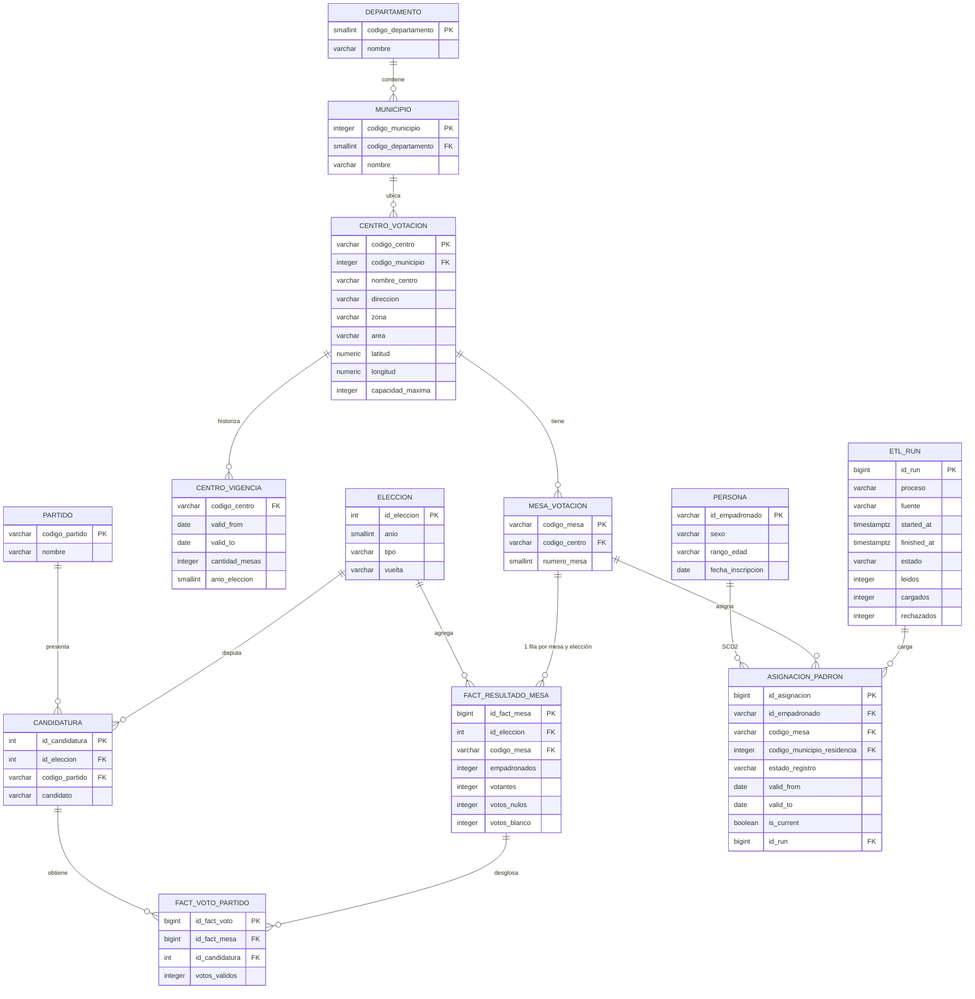

# Análisis crítico del modelo de datos

El modelo analizado es el de `sql/01_ddl_electoral.sql`, documentado en `docs/BASE_DE_DATOS.md`. **No lo modifiqué.** Cargué sobre él y, aparte, dejo esta propuesta. El script opcional está en `sql/99_propuesta_mejoras.sql` (esquema `electoral_propuesto`; Docker **no** lo ejecuta al iniciar).

Escribo en primera persona: son los problemas que me encontré al construir el ETL y al pensar el dashboard de saturación, participación y cobertura del padrón.

## 1. Problemas identificados

Ordenados por impacto (mayor a menor).

| # | Problema | Tabla / columna afectada | Consecuencia concreta | Severidad |
|---|---|---|---|---|
| 1 | Casi todo es `VARCHAR(50)`, incluidos votos, coordenadas, años y fechas. | `centros_votacion.latitud/longitud/cantidad_mesas/capacidad_maxima`, `resultados_elecciones.votos_*` y totales, `empadronados.fecha_*`, `fechaCarga` | En el ETL tuve que parsear coma decimal, miles y dos formatos de fecha. En el dashboard un `SUM(votos_validos)` sin `CAST` falla o concatena texto. Un mapa no puede pintar `latitud = '16,489162'`. | Alta |
| 2 | El padrón es una foto que se sobrescribe. No hay vigencia (`valid_from` / `valid_to`). | `empadronados` (PK = `id_empadronado`) | Un traslado del 2 al 3 de marzo **borra** el centro/mesa anteriores. No puedo responder “¿cuántos se movieron de Mixco a Villa Nueva?” ni reconstruir el padrón del día 2 sin releer el CSV. `periodo` (script 02) solo etiqueta la foto vigente; no es historia. | Alta |
| 3 | No hay unicidad de negocio ni FKs. Las PKs son `SERIAL` (o el id del padrón). | `centros_votacion.codigo_centro_votacion`, `mesas_votacion.codigo_mesa`, grano de `resultados_elecciones` | Reejecutar un `INSERT` duplica centros y resultados. Por eso el histórico es `TRUNCATE` + `INSERT` en transacción: la idempotencia vive en el ETL, no en la base. El centro huérfano `0104999` entra en resultados si no lo filtro yo. | Alta |
| 4 | Grano mezclado en resultados: votos del partido y totales de la mesa en la misma fila. | `resultados_elecciones.votos_nulos`, `votos_en_blanco`, `total_*_mesa` | Esos totales se **repiten en cada partido**. Un `SUM(votos_nulos)` infla nulos × N partidos. El dashboard de participación se equivoca si nadie conoce esa trampa. | Alta |
| 5 | Geografía desnormalizada y sin catálogo. | `nombre_departamento` / `nombre_municipio` en centros **y** otra vez en resultados; residencia del padrón solo trae códigos | `PETÉN`, `Peten` y ` Petén ` partían un mismo departamento. Resultados no traen nombres: los copié del catálogo. Residencia no se puede etiquetar sin un catálogo de municipios. | Media |
| 6 | Bitácora libre, corta y sin estructura. El watermark se disfraza en el nombre del proceso. | `carga_log.observacion VARCHAR(255)`, `fecha VARCHAR`, sin estado ni conteos | Recorté métricas para que cupieran. No hay `filas_leidas`, `rechazados` ni `duracion` consultables. Detectar “¿ya corrí el 2026-03-03?” es un `LIKE 'empadronados:%'` sobre texto. | Media |
| 7 | Sin índices de consulta ni integridad referencial. | Joins por `codigo_centro_votacion` / `codigo_mesa` / departamento | Con 18k filas no se nota. Con 9 millones de padrón diario el dashboard (cobertura por municipio, saturación de centro) hace seq scan y el upsert toca la tabla entera. | Media |
| 8 | Las mesas no son una fuente: las derivé. `cantidad_mesas` en el centro puede mentir. | `mesas_votacion` vs `centros_votacion.cantidad_mesas` | Si el CSV de centros dice 8 mesas y en resultados aparecen 12, no hay quién gane. El modelo no declara de dónde sale la verdad. | Media |
| 9 | Centros “con correcciones ocasionales” pero sin vigencia. | `centros_votacion.anio_vigencia` (también `VARCHAR`) | Una corrección de nombre o de coordenadas pisa el valor usado en la elección anterior. No puedo saber cómo se llamaba el centro en 2023. | Baja |
| 10 | Inconsistencia de nombres (`fechaCarga` vs `snake_case`) y `created_at` solo en padrón. | varias | El SQL del dashboard mezcla estilos. `created_at` no es la fecha de la foto: es el insert técnico. | Baja |

## 2. Modelo propuesto

Enfoque: **por capas (staging → 3FN operativa → hechos para el dashboard)**, no un único esquema “todo VARCHAR”.

- **Staging** copia el CSV casi crudo (auditoría; cuarentena sigue en archivos o pasa a tabla).
- **Núcleo normalizado** con tipos reales, unicidad de negocio y FKs.
- **Hechos** al grano que el dashboard necesita: una fila de votos por mesa+partido; otra de totales de mesa; asignación del padrón **versionada** (SCD2).

No propongo un star schema puro como único modelo: el operacional (padrón vivo, catálogo de centros) y el analítico (hechos de elección) conviven. El dashboard lee vistas o las tablas de hechos, no el VARCHAR actual.

### 2.1 DER propuesto

### 2.2 Cambios clave respecto al modelo actual

| # | Cambio | Qué resuelve | Costo o riesgo |
|---|---|---|---|
| 1 | Tipos nativos: `numeric` coords, `integer` votos y capacidades, `date` / `timestamptz`, `smallint` año | El dashboard suma y filtra sin `CAST`. El ETL valida rangos en la base, no solo en Python. | Hay que fijar la semántica de vacíos (`NULL` vs 0). |
| 2 | `UNIQUE` de negocio + FKs (`codigo_centro`, `codigo_mesa`, grano elección+mesa+partido) | Idempotencia con `ON CONFLICT`. Los huérfanos no entran. | Hay que decidir qué hacer con `0104999`: staging + cuarentena, no silenciar. |
| 3 | Partir resultados en `fact_resultado_mesa` + `fact_voto_partido` | `SUM(votos_nulos)` ya no se multiplica por partidos. Saturación y participación salen de una fila por mesa. | Hay que reescribir las consultas del dashboard. |
| 4 | Catálogos `departamento` y `municipio` | Un nombre canónico. El padrón puede mostrar residencia, no solo un código. | Cargar y mantener el catálogo (hoy sale de centros). |
| 5 | Padrón SCD2 (`asignacion_padron`) + `persona` estable | Conservo traslados y bajas en el tiempo. Puedo reconstruir la foto de cualquier día con `valid_from/valid_to`. | Más filas y más cuidado en el upsert diario. |
| 6 | `etl_run` estructurado | Watermark, duración y rechazos consultables. Alertas sobre `estado = 'fallido'`. | Migrar el texto de `carga_log`. |
| 7 | Índices `(codigo_municipio)`, `(id_eleccion, codigo_mesa)`, `(id_empadronado, is_current)` | El dashboard y el incremental a 9M no recorren la tabla. | Un poco más de costo en escritura. |

### 2.3 Historización

**Empadronado (prioridad).** Hoy una fila = la última foto. Si alguien cambió de centro entre el 2026-03-02 y el 2026-03-03, en mi carga actual **sobrevive solo el centro nuevo**; el anterior se perdió. Lo mismo con `estado_registro`: veo que pasó a `fallecido`, no cuándo ni desde qué mesa.

Lo representaría con SCD2 en `asignacion_padron`:

- `valid_from` = fecha del archivo que introdujo esa asignación.
- `valid_to` = día anterior a la siguiente foto distinta (o `NULL` si es la vigente).
- `is_current` para el dashboard del “hoy”.

Eso habilita: traslados netos por municipio, padrón activo a una fecha, tiempo en la misma mesa, bajas entre dos cortes. Con el modelo actual esas preguntas **no se pueden responder** sin guardar los CSV.

**Centro.** `centro_vigencia` guarda cantidad de mesas, nombre y año electoral. Una corrección de 2024 no pisa el centro de 2023. El dashboard de saturación histórica usa la vigencia de esa elección, no el último `UPDATE`.

## 3. Plan de migración

Expand-contract: el dashboard sigue leyendo las tablas actuales (o una vista con los mismos nombres) hasta el corte. **No** hago `DROP SCHEMA electoral CASCADE` en producción.

| Paso | Acción | Reversible | Riesgo |
|---|---|---|---|
| 1 | Crear esquema `electoral_propuesto` (o tablas nuevas en `electoral`) **al lado** del modelo actual. Cero cambio de la app. | Sí: `DROP` del esquema nuevo. | Bajo |
| 2 | Backfill: catálogos desde `centros_votacion` distintos; mesas desde `mesas_votacion`; hechos partiendo resultados (una fila de mesa + N de partido). | Sí: truncar lo nuevo. | Medio: hay que repetir las reglas de estandarización del ETL. |
| 3 | Padrón: la foto vigente llena `persona` + una sola versión `is_current`. Los CSV de `data/empadronados/` se reprocesan en orden para armar SCD2 (02 → 03 → 04). Sin esos archivos, la historia **ya se perdió**. | Parcial: se puede volver a cargar solo `is_current`. | Medio |
| 4 | Vistas de compatibilidad con los nombres viejos (`electoral.v_resultados_elecciones`, etc.) para el dashboard. Dual-write: el ETL escribe propuesto **y** actual. | Sí: el dashboard no se enteró. | Medio: hay que mantener dos escrituras. |
| 5 | El dashboard apunta a hechos/vistas nuevas. Validar KPIs (participación, votos por partido) contra la corrida anterior. | Sí: rollback de connection string / search_path. | Medio |
| 6 | Dejar de escribir el modelo viejo. Índices y FKs ya están en el nuevo. Archivar `VARCHAR` un tiempo. | Costoso de revertir si se borró. | Bajo si el paso 5 llevó días en paralelo |

**Qué haría primero:** unicidad + FKs + partir los totales de mesa (problemas 3 y 4). Es lo que más distorsiona el dashboard y lo que más me obligó a compensar en Python. La SCD2 del padrón es la siguiente: sin ella cada día de producción tira historia que no se recupera.

**Qué no haría primero:** índices agresivos sobre el modelo VARCHAR actual. Ayudan poco si el grano y los tipos siguen mal.
