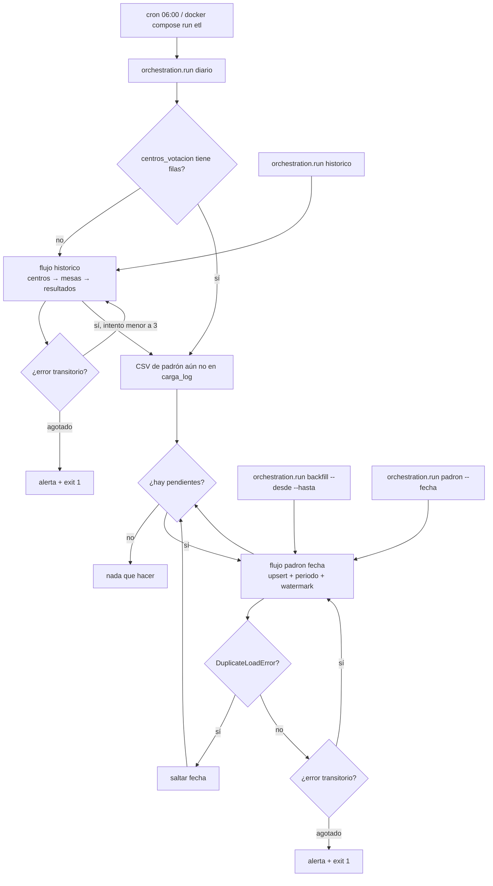

# Estrategia de orquestación

Elegí un orquestador **ligero: Python + cron** (y el mismo comando dentro de Docker). Los dos flujos viven en `orchestration/run.py`. No monté Airflow ni Prefect porque el caso son dos jobs, una dependencia y un backfill puntual: un scheduler de plataforma me sobra para esta prueba y para un equipo chico.

## 1. Herramienta seleccionada

**Elección:** `cron` + módulo `python -m orchestration.run`, con el mismo entrypoint en el servicio `etl` de Docker Compose.

**Justificación:** el histórico corre una vez y el padrón es un CSV diario. Necesito dependencias (padrón después de centros), reintentos ante Postgres caído, no reintentar un periodo ya cargado, alertas simples y un backfill por rango. Eso lo cubro sin DAG server, sin base extra y sin secretos de un orquestador. El CLI del ETL (`main.py`) sigue siendo la unidad de trabajo; el orquestador solo programa, reintenta y alerta.

### 1.1 Comparación con alternativas

| Herramienta | Ventajas | Desventajas | Por qué (no) la elegí |
|---|---|---|---|
| **cron + Python** (elegida) | Cero infra extra, mismo código que el CLI, fácil de correr en Docker o en la máquina del evaluador | No hay UI de DAGs, alertas son archivo + `carga_log`, el catch-up lo programé yo | Encaja con dos flujos y con el tiempo de la prueba |
| Airflow | Dependencias explícitas, UI, reintentos nativos, backfill | Scheduler + metadata DB; pesado para dos tasks | Lo usaría si hubiera decenas de fuentes o varios equipos disparando DAGs |
| Prefect / Dagster | DX moderna, retries, assets | Hay que levantar agente/cloud o un daemon | Sobreingeniería aquí; Prefect me tentó por el `@flow` pero no aporta frente a un módulo de 200 líneas |
| GitHub Actions | Ya hay git, cron `schedule`, logs en el PR | El runner no ve el Postgres local; secretos y self-hosted para data | Útil como CI de `pytest`, no como cargador diario contra la DB de la prueba |

## 2. Diseño de los flujos

| Flujo | Disparador | Frecuencia | Depende de | Reintentos | Acción ante fallo |
|---|---|---|---|---|---|
| Carga histórica | Manual, primer `diario`, o `docker compose run etl` | Una vez (idempotente: `TRUNCATE` + `INSERT`) | — | 3 intentos, espera 2s / 4s / 8s, solo errores transitorios | Alerta en `logs/alerts.log` y fila en `carga_log`; exit 1 |
| Carga incremental del padrón | Cron 06:00 (`diario`) o fecha puntual (`padron` / `backfill`) | Diaria; catch-up de CSV pendientes en orden | Histórico (centros en DB). Si está vacío, `diario` lo carga antes | Igual que histórico. **No** reintenta `DuplicateLoadError` | Alerta y corta el lote; los periodos ya ok se quedan |

### 2.1 Diagrama



## 3. Manejo de fallos

- **Reintentos:** 3 intentos con backoff exponencial (2s, 4s, 8s) para caídas de red, Postgres aún no listo, etc. No reintento validaciones de negocio (`DuplicateLoadError`, archivo inexistente, fecha mal formada): reintentar eso duplicaría trabajo o spamearía el mismo error.
- **Alertamiento:** cada fallo terminal escribe una línea JSON en `logs/alerts.log` y, si la DB responde, una fila `alerta:<proceso>` en `electoral.carga_log`. En un entorno real colgaría un webhook (correo/Slack) de ese archivo; aquí el evaluador lo ve en logs y en la bitácora de la UI.
- **Idempotencia ante reejecución:** el histórico reemplaza las tres tablas en transacción. El padrón hace upsert por `id_empadronado` y borra ausentes. Reejecutar `diario` cuando no hay CSV nuevos no hace nada. Reejecutar un periodo ya cargado exige `--overwrite` (o el diálogo de la UI).

## 4. Backfill

Un rango de fechas, solo los días que tienen archivo. Sin `--overwrite` salta los ya cargados. Con `--overwrite` reaplica la foto y actualiza `periodo`.

```bash
# Catch-up de lo que falte (también lo hace el job diario)
python -m orchestration.run diario

# Rango concreto
python -m orchestration.run backfill --desde 2026-03-02 --hasta 2026-03-04

# Reprocesar un día ya cargado
python -m orchestration.run padron --fecha 2026-03-03 --overwrite
python -m orchestration.run backfill --desde 2026-03-02 --hasta 2026-03-03 --overwrite
```

## 5. Cómo ejecutarlo

Desde el repo, con Postgres arriba y `.env` cargado:

```bash
source .venv/bin/activate
python -m orchestration.run historico
python -m orchestration.run diario
python -m orchestration.run padron --fecha 2026-03-02
python -m orchestration.run backfill --desde 2026-03-02 --hasta 2026-03-04
```

Cron de ejemplo: `orchestration/crontab`.

Con Docker el comando único es `./up.sh` (tests → Postgres con el volumen existente → API/UI en :8000). El job diario **no** arranca solo. Para disparar flujos a mano:

```bash
./up.sh
docker compose --profile etl run --rm etl -m orchestration.run historico
docker compose --profile etl run --rm etl -m orchestration.run diario
```

Horario que asumo para el padrón: **06:00 hora local**, después de que el archivo del día ya debería estar en `data/empadronados/`.
